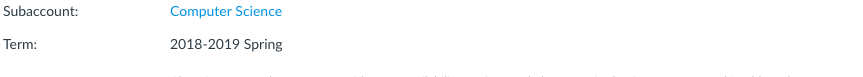
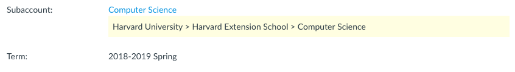
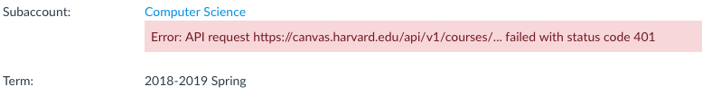

# Bookmarklets

This is a repository of bookmarklets or mini apps that you can store in your browser bookmarks and run with one click.  

Want to know more about bookmarklets?

- [Mozilla: Use bookmarklets to quickly perform common web page tasks](https://support.mozilla.org/en-US/kb/bookmarklets-perform-common-web-page-tasks)
- [Wikiedia: Bookmarklets](https://en.wikipedia.org/wiki/Bookmarklet)

_Note: This was created as a [ShipIt](https://www.atlassian.com/company/shipit) project in HUIT AT._

## Bookmarklets for [Canvas LMS](https://www.canvaslms.com/)

### Task: Quick identification of which school a course is associated with 

> When examining the Settings of a Canvas course in the residential instance, it's not always possible to tell which school a course is associated with. It's easy to identify the school if the course lives in a school sub-folder. But if a course lives in a sub-sub-folder, i.e. a department within a school, there's no way to tell which school the department and course belongs to. The outcome of this project would a be a self-service tool that makes it easy to **identify which school a course belongs to**, which can be important when responding to support tickets. 

```
javascript:!function(){"use strict";var o=[],r={credentials:"same-origin",headers:{Accept:"application/json"}};function n(e){return fetch("/api/v1/accounts/"+e,r).then(l)}function c(e){return n(e.account_id)}function a(e){return o.push(e),e.parent_account_id?n(e.parent_account_id).then(a):o}function l(e){if(e.ok)return e.json();throw new Error("API request "+e.url+" failed with status code "+e.status)}function t(e,o){(o=o||{}).color=o.color||"#000",o.backgroundColor=o.backgroundColor||"#fff3cd";var n,t=document.getElementById("course_account_id");return t&&((n=document.createElement("span")).style.display="block",n.style.color=o.color,n.style.backgroundColor=o.backgroundColor,n.style.padding=".5em",n.style.marginBottom="1em",n.appendChild(document.createTextNode(e)),t.parentNode.appendChild(n)),t}function u(e){var o=e.slice().reverse().map(function(e){return e.name}).join(" > ");return console.log(e),console.log(o),t(o)||alert(o),e}function s(e){var o="Error: "+e.message;return console.log(e),t(o,{color:"#721c24",backgroundColor:"#f8d7da"})||alert(o),e}!function(){var e,o=window.location.pathname.match(/^\/courses\/(\d+)/),n=o?o[1]:null;if(n)console.log("Script executing..."),(e=n,fetch("/api/v1/courses/"+e,r).then(l)).then(c).then(a).then(u).catch(s);else{var t="Please run this on a Canvas Course Settings page.";console.log(t),alert(t)}}()}();
```

[Unminified Source Code](src/canvaslms-course-show-accounts.js)

**Bookmark Usage:**

1. Create a new bookmark:
    - Enter a name for the bookmark (e.g. `course-show-accounts.js`).
    - Copy and paste the code into the bookmark URL.
    - Save the bookmark.
2. Navigate to a canvas course and visit the settings page.
3. Click the bookmark to run the code snippet.
4. If it worked, you should see something like this:

| Succces (Before and After) | 
|---|
|  | 
|  |

5. If it failed, you should see an error message explaining what went wrong. For example, if your login session expired, then you will see an error message like this:

| Error (401 Unauthorized) |
|---|
|  |

## Contributing a bookmarklet

1. Write some javascript to implement a task. The developer console is great for testing your code.
2. Prepare for deployment as bookmarklet by minifying the JS (e.g. https://jscompress.com/). 
3. Test and validate the minified code.
4. Update the README with a description of the bookmarklet and the minfiied version of the JS so that anyone can easily copy and paste the code into their bookmarks.
5. Submit a pull request with the source code and updates to the README.
