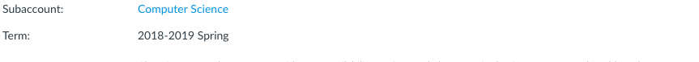
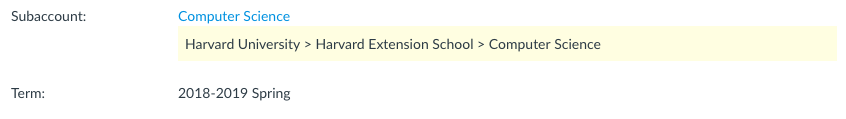

# Bookmarklets

This is a repository of bookmarklets or mini apps that you can store in your browser bookmarks and run with one click.  

Want to know more about bookmarklets?

- [Mozilla: Use bookmarklets to quickly perform common web page tasks](https://support.mozilla.org/en-US/kb/bookmarklets-perform-common-web-page-tasks)
- [Wikiedia: Bookmarklets](https://en.wikipedia.org/wiki/Bookmarklet)

_Note: This was created as a [ShipIt](https://www.atlassian.com/company/shipit) project in HUIT AT._

## Canvas LMS

### Quick identification of which school a course is associated with 

> When examining the Settings of a Canvas course in the residential instance, it's not always possible to tell which school a course is associated with. It's easy to identify the school if the course lives in a school sub-folder. But if a course lives in a sub-sub-folder, i.e. a department within a school, there's no way to tell which school the department and course belongs to. The outcome of this project would a be a self-service tool that makes it easy to **identify which school a course belongs to**, which can be important when responding to support tickets. 

**Bookmark Name:** 

```
canvaslms-course-settings-find-accounts.js
```

_Note that the bookmarklet name can be anything you want. The above is just an example._

**Bookmark URL:**
```
javascript:!function(){"use strict";var t=[],r={credentials:"same-origin",headers:{Accept:"application/json"}};function n(e){return fetch("/api/v1/accounts/"+e,r).then(u)}function c(e){return n(e.account_id)}function a(e){return t.push(e),e.parent_account_id?n(e.parent_account_id).then(a):t}function u(e){if(e.ok)return e.json();throw new Error("API request "+e.url+" failed with status code "+e.status)}function s(e){e.slice(0);return e.reverse().map(function(e){return e.name}).join(" > ")}function i(e,t){(t=t||{}).color=t.color||"#000",t.backgroundColor=t.backgroundColor||"#fff3cd";var n,o=document.getElementById("course_account_id").parentNode;return o&&((n=document.createElement("span")).style.display="block",n.style.color=t.color,n.style.backgroundColor=t.backgroundColor,n.style.padding=".5em",n.style.marginBottom="1em",n.appendChild(document.createTextNode(e)),o.appendChild(n)),e}function l(e){return i("Error: "+e.message,{color:"#721c24",backgroundColor:"#f8d7da"}),e}!function(){var e,t=window.location.pathname.match(/^\/courses\/(\d+)\/settings/),n=t?t[1]:null;if(n)console.log("Script executing..."),(e=n,fetch("/api/v1/courses/"+e,r).then(u)).then(c).then(a).then(s).then(i).catch(l);else{var o="Script not executed. Please run this on the Canvas Course Settings page (e.g. /courses/:id/settings).";console.log(o),alert(o)}}()}();
```

[Unminified Source Code](canvaslms/course-settings-find-all-accounts.js)

**Usage:**

1. Add the bookmark (e.g. copy and paste the name and url).
2. Navigate to a course settings page in canvas.
3. Run the code by clicking on the bookmark.
4. If it worked, you should see something like this:

| Before and After | 
|---|
|  | 
|  |


## Development Process

1. Write some JS to implement a task (use developer console to test functionality).
2. Commit JS to git repository when it's done.
3. Prepare for deployment as bookmarklet by minifying the JS (e.g. https://jscompress.com/).
4. Test and validate minified bookmarklet.
5. Update the README with a description of the bookmarklet and the minfiied version of the JS.
